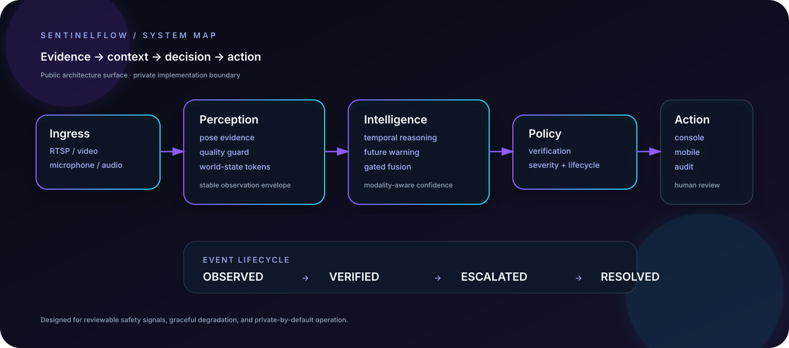
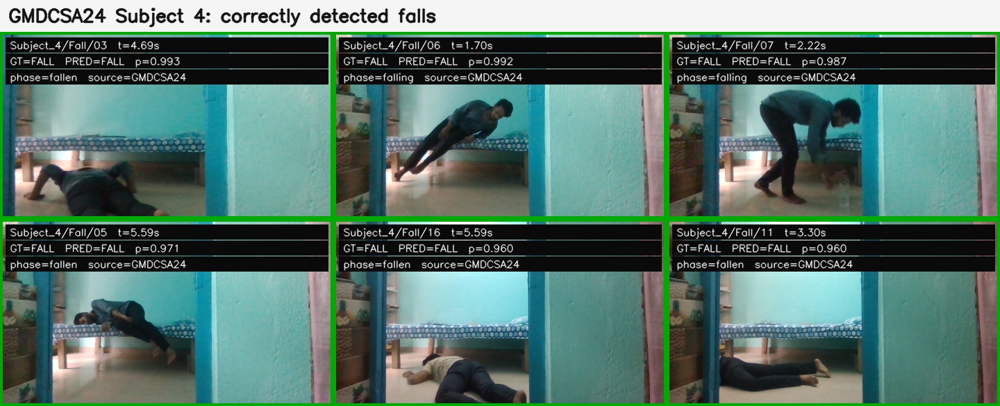
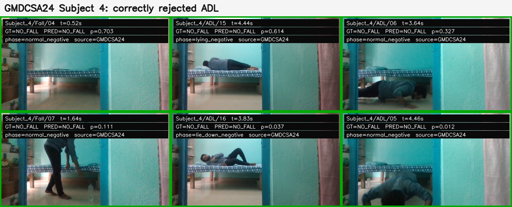
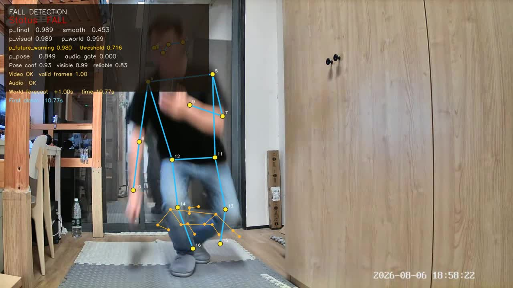
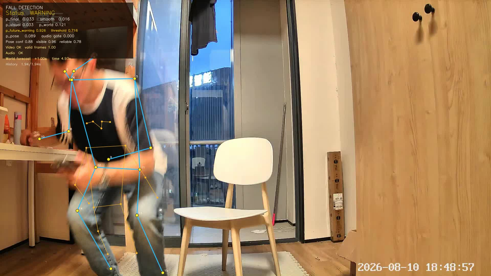
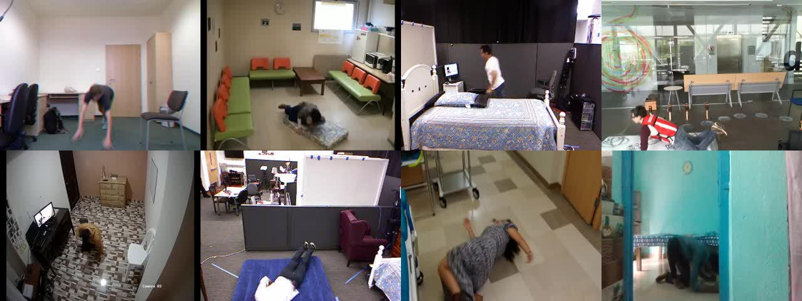
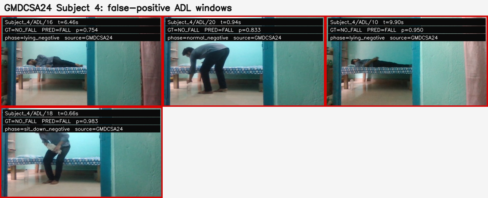
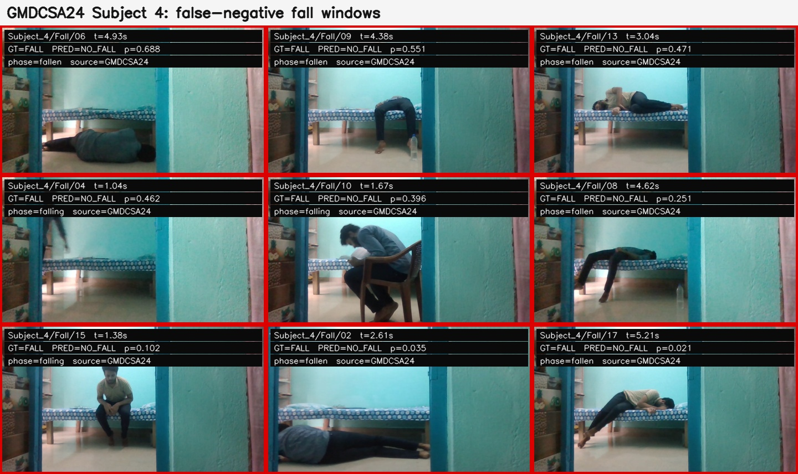

<div align="center">

# SENTINELFLOW

### Multimodal human-safety intelligence for real-time environments

<p>
  <a href="#capability-surface"></a>
  <a href="#architecture"></a>
  <a href="#validation-snapshot"></a>
  <a href="https://github.com/hanfeny7"></a>
</p>

<p><em>A publication-grade system profile for a private, production-oriented research platform.</em></p>

<p>
  <a href="docs/ARCHITECTURE.md">Architecture</a> ·
  <a href="docs/EVALUATION.md">Evaluation</a> ·
  <a href="docs/API_CONTRACT.md">Public contracts</a> ·
  <a href="docs/PUBLICATION_POLICY.md">Release boundary</a>
</p>

</div>

<p align="center"></p>

> SentinelFlow turns live video, pose evidence, temporal context, and optional audio into explainable safety events. This repository is intentionally a **showcase surface**: it documents the system boundary and demonstrated capabilities without publishing private implementation, weights, datasets, credentials, or operational scripts.

## Capability surface

| Layer | What it demonstrates | Publication status |
|---|---|---|
| Perception | Person/pose evidence, quality gating, occlusion-aware observations | Interface only |
| Temporal intelligence | Windowed motion reasoning, future-warning path, confidence smoothing | Design documented |
| Multimodal fusion | Video + pose + audio evidence with gated fusion | Architecture documented |
| Event intelligence | Detection → verification → escalation → acknowledgement → audit | Contract published |
| Operations | Live monitoring, device inventory, event center, review surfaces | UX surface documented |
| Deployment | GPU inference path, service health checks, web/mobile entry points | Runbook summarized |

## Validation snapshot

These figures are an internal engineering snapshot from the underlying research branches, not a universal benchmark or production SLA.

<div align="center">

| 93.75% | <5 ms | 4 modalities | 6-stage lifecycle |
|:---:|:---:|:---:|:---:|
| best validation accuracy* | pose inference path* | video · pose · audio · context | observable event state machine |

</div>

\* Internal pose-transformer evaluation on a held-out UR-Fall split; GPU timings measured on an RTX 4060 Ti-class setup. See [the evaluation note](docs/EVALUATION.md) for scope and caveats.

## Detection gallery

The gallery is split into **wins**, **hard negatives**, and **failure analysis**. Green borders show accepted or correctly rejected windows; red borders are retained because a serious safety system must make its blind spots reviewable.

<table>
<tr>
<td width="50%"></td>
<td width="50%"></td>
</tr>
<tr>
<td align="center"><sub>TRUE POSITIVE · falling / fallen · confidence trace</sub></td>
<td align="center"><sub>TRUE NEGATIVE · daily activity rejected</sub></td>
</tr>
<tr>
<td width="50%"></td>
<td width="50%"></td>
</tr>
<tr>
<td align="center"><sub>RUNTIME VIEW · pose + world + future-warning evidence</sub></td>
<td align="center"><sub>EARLY WARNING · temporal lead signal</sub></td>
</tr>
</table>

<p align="center"></p>

<details>
<summary><b>Open the hard cases and error audit</b></summary>

<table>
<tr>
<td width="50%"></td>
<td width="50%"></td>
</tr>
<tr>
<td align="center"><sub>FALSE POSITIVE · sit / lie transitions resembling a fall</sub></td>
<td align="center"><sub>FALSE NEGATIVE · occlusion and ambiguous posture</sub></td>
</tr>
</table>

</details>

The [full results gallery](docs/RESULTS.md) contains additional scenes across multiple camera layouts and dataset families. These examples are review artifacts, not a claim of universal performance.

## Architecture

```text
                 ┌────────────────────────────────────────────────────┐
                 │                    EXPERIENCE PLANE                │
                 │  Live console · event center · mobile entry points  │
                 └──────────────────────────────┬─────────────────────┘
                                                │ typed events
┌──────────────┐   ┌──────────────┐   ┌─────────▼─────────┐   ┌──────────────┐
│ Video / RTSP │──▶│ Pose evidence│──▶│ Temporal + future │──▶│ Event policy │
└──────────────┘   └──────────────┘   │ reasoning          │   └──────┬───────┘
                                     └─────────┬─────────┘          │
┌──────────────┐   ┌──────────────┐           │                     ▼
│ Audio stream │──▶│ Audio cues   │───────────┘              ┌──────────────┐
└──────────────┘   └──────────────┘                          │ Audit + sync │
                                                            └──────────────┘
```

For the full system map, data contracts, and deployment boundaries, read [docs/ARCHITECTURE.md](docs/ARCHITECTURE.md).

## Why this is not the full source tree

The public repository deliberately excludes:

- model checkpoints, private datasets, captured media, and derived embeddings;
- core training recipes, proprietary fusion modules, threshold schedules, and internal experiment runners;
- service credentials, device identifiers, network addresses, and personal submission materials;
- vendored environments, generated artifacts, and third-party source that should remain upstream.

The public contracts under [`public/contracts`](public/contracts) are stable, redacted examples for integration conversations—not a drop-in production implementation.

## Repository map

```text
.
├── README.md                         # project profile and capability map
├── docs/
│   ├── ARCHITECTURE.md               # system boundaries and data flow
│   ├── EVALUATION.md                 # metric definitions and caveats
│   ├── API_CONTRACT.md               # redacted public-facing contracts
│   ├── PUBLICATION_POLICY.md         # what is intentionally withheld
│   ├── architecture.svg              # hero system diagram
│   ├── index.html                    # GitHub Pages showcase
│   └── styles.css                    # presentation system
├── public/
│   ├── config.example.yaml           # non-secret deployment shape
│   └── contracts/                    # example request/response shapes
└── .github/workflows/pages.yml       # optional Pages deployment
```

## Responsible-use boundary

This project is an assistive safety system, not a medical device and not a replacement for human judgement. Any deployment involving older adults, audio, cameras, or notifications must obtain appropriate consent, minimize retention, secure transport, and include a human review path.

## Status

**Showcase release · 2026.09**

The source implementation remains private while the architecture, capability surface, and evidence framing are made reviewable. Access to a technical evaluation build can be arranged separately.

<div align="center">

<sub>Designed as a system profile, not a code dump.</sub>

</div>
