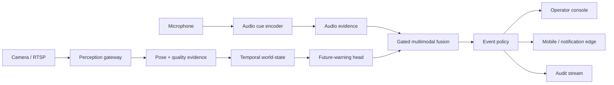

# Architecture brief

SentinelFlow is organized as a set of evidence-producing stages rather than a single monolithic classifier. Each stage emits typed observations, and the event policy decides when evidence is strong enough to become an operator-visible event.

## System boundary



## Evidence plane

### 1. Perception gateway

The gateway normalizes camera frames and exposes a stable observation envelope. It can be backed by a pose detector, a world-model encoder, or a deployment-specific adapter without changing the event contract.

The public release intentionally omits detector weights, training code, and camera-specific adapters. The integration boundary is represented by [`public/contracts/observation.json`](../public/contracts/observation.json).

### 2. Pose and quality evidence

Pose evidence contains keypoint geometry, visibility, motion deltas, and a quality score. Quality is treated as first-class evidence: low-confidence or heavily occluded observations should reduce escalation confidence instead of silently becoming a positive prediction.

### 3. Temporal world-state

Short windows of observations are transformed into a temporal state. The internal branches explored sequence models, world-model representations, future-warning heads, and lightweight temporal residuals. The public surface documents the contract and state transitions, not the proprietary feature extractor.

### 4. Gated multimodal fusion

Audio is an optional evidence stream. The fusion boundary is designed to degrade gracefully when audio is absent, noisy, or unavailable. A modality gate records which streams contributed to an event so operators can distinguish a fully observed alert from a visual-only fallback.

### 5. Event policy

The policy layer owns hysteresis, temporal voting, duplicate suppression, severity, acknowledgement, and escalation. It is deliberately separated from the model so that an operator can audit *why* an event was raised.

## Event lifecycle

```text
OBSERVED → VERIFIED → ESCALATED → ACKNOWLEDGED → RESOLVED
                │           │              │
                └───────────┴──────────────┴── AUDIT RECORD
```

The state machine is monotonic for ordinary operation. A new observation can create a new event after the previous event is resolved, but a single active incident is not repeatedly re-created by every frame.

## Deployment topology

| Plane | Typical responsibility | Publicly described |
|---|---|---:|
| Edge | camera/audio ingress, buffering, local health | yes |
| Inference | pose, world-state, fusion, policy | boundary only |
| Control | device list, live view, event review, operator actions | yes |
| Mobile | compact event view, binding, notifications | yes |
| Audit | event timeline, evidence pointers, retention policy | yes |

## Design principles

1. **Evidence before alarm** — raw model output is not the same thing as an operator event.
2. **Graceful degradation** — a missing modality is recorded, not hidden.
3. **Human-readable state** — every event has a lifecycle and an explainable reason code.
4. **Private by default** — captured media and embeddings stay outside the public repository.
5. **Replaceable inference** — model versions can evolve behind a stable observation contract.
