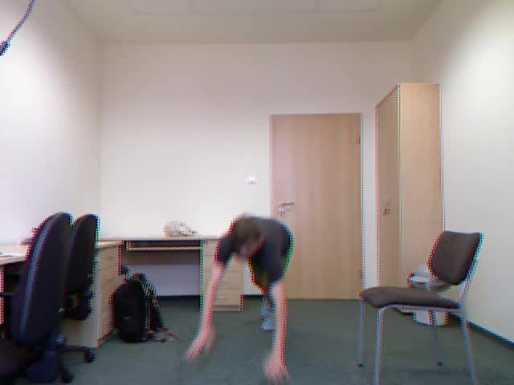
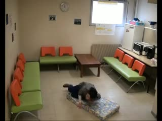
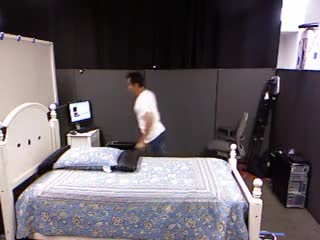
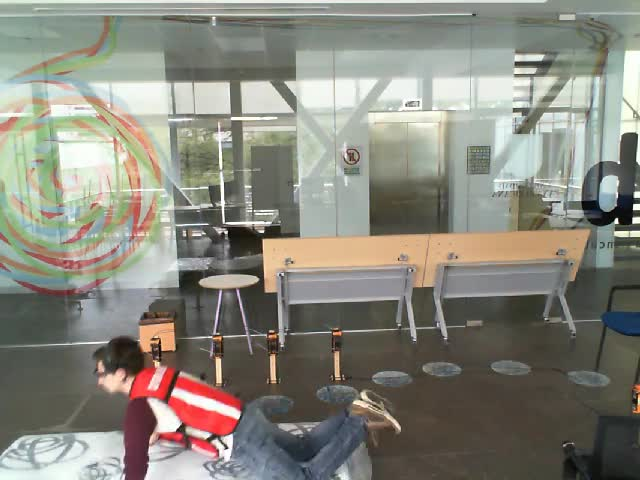
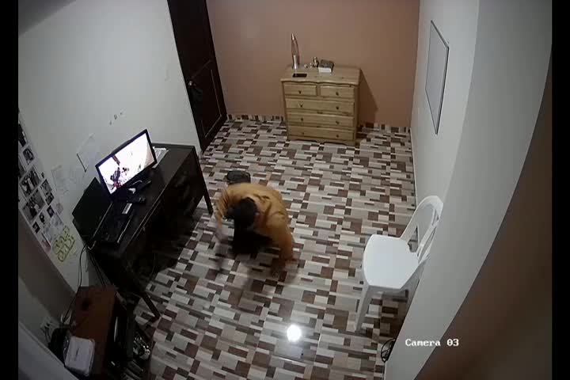
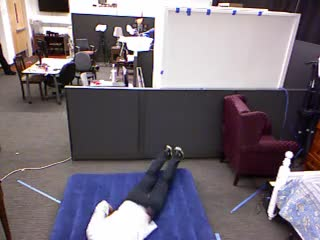
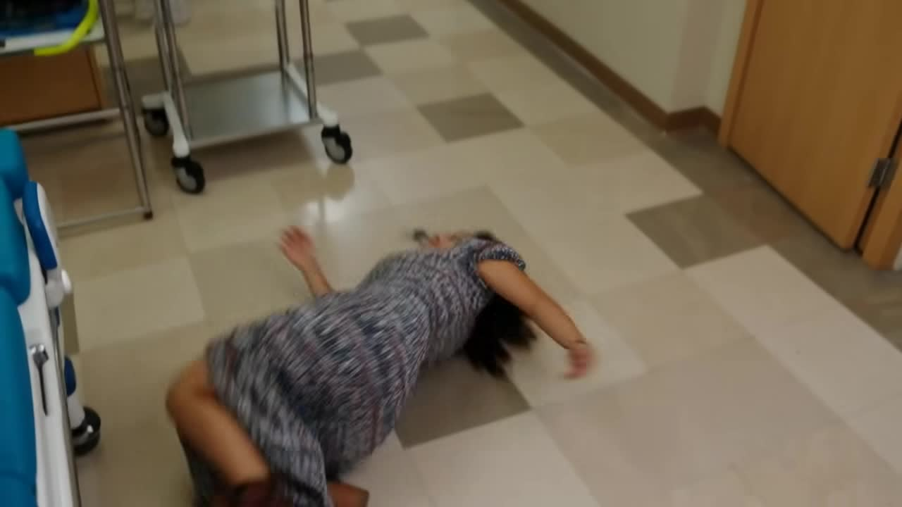
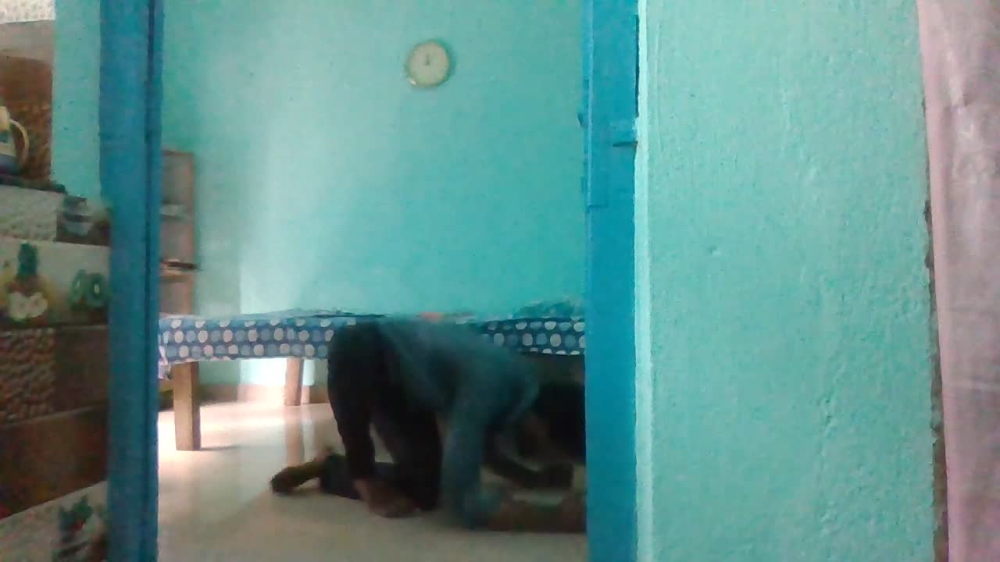

# Results gallery

This page is a visual audit trail: it shows what the system sees when it is right, when it is uncertain, and when it needs more work.

## Cross-scene wins

<table>
<tr>
<td width="25%"></td>
<td width="25%"></td>
<td width="25%"></td>
<td width="25%"></td>
</tr>
<tr>
<td align="center">Fall17 · pose evidence</td>
<td align="center">Le2i · indoor fall</td>
<td align="center">Occlusion stress case</td>
<td align="center">UpFall · recovery context</td>
</tr>
<tr>
<td></td>
<td></td>
<td></td>
<td></td>
</tr>
<tr>
<td align="center">CaucaFall · camera shift</td>
<td align="center">EDF · low-light room</td>
<td align="center">OFSynth · synthetic variation</td>
<td align="center">GMDCSA24 · cross-subject test</td>
</tr>
</table>

## Reading the overlays

- **Green frame** — accepted true-positive or correctly rejected negative window.
- **Red frame** — false-positive or false-negative window retained for error analysis.
- **Pose points and lines** — geometric evidence available to the temporal path.
- **world / future / audio fields** — which evidence channels contributed to the decision.
- **phase** — a coarse temporal interpretation such as `falling`, `fallen`, or `normal_negative`.

## Why show failures?

The red examples are not decoration. They are the boundary conditions that shape thresholding, quality gating, temporal voting, and human review. Publishing them makes the engineering claim more credible and gives future improvements a visible target.

> These images come from internal review artifacts and public/research evaluation scenes. They are not a substitute for a dataset card, subgroup analysis, or safety certification.
